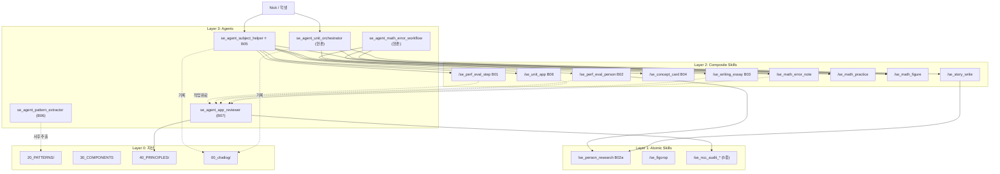

# 51_MASTER_PLAN — Agent/Skill 일반화 시스템 마스터 플랜

> 작성: 2026-05-12 (Round 2) | NCC
> 출처: Nick 요청 "전체 agent/skill master plan, link diagram 을 현재 자료만 갖고"
> 보조 문서: `50_BLUEPRINTS.md` (개별 청사진 명세) — 이 파일은 **전체 그림 + 빌드 순서**.

---

## 0. 이 파일이 답하는 것

| 질문 | 답이 어디에 |
|---|---|
| 어떤 skill/agent가 있나? (현존 + 계획) | §1 인벤토리 |
| 누가 누구를 호출하나? | §2 링크 다이어그램 |
| 어떻게 계층화되나? | §3 4-Layer 모델 |
| 무엇을 먼저 만드나? | §4 빌드 순서 (Phase A~F) |
| 의존성은? | §5 의존 관계 표 |
| 언제 무엇이 끝나야 다음 단계로? | §6 진입·종료 조건 |

> Nick 응답 (Q05 명확화): 과목 앱 만드는 우선순위는 X. **일반화된 agent/skill 시스템 자체가 산출물**.
> 그 시스템이 안정되면 어떤 과제가 와도 빠르게 응답 가능. 이 마스터 플랜은 그 시스템의 빌드 로드맵.

---

## 1. 인벤토리 — 현존 + 계획

### 1.1 자식 프로젝트의 **현존** Skill/Agent

#### MathTelling (`30_MS/260426_MathTelling_Idea/.claude/`)

| 종류 | 이름 (현행) | 미래 이름 (`se_*` 적용 후) | 비고 |
|---|---|---|---|
| Agent | `unit-orchestrator` | `se_agent_unit_orchestrator` | 단원 파이프라인 |
| Skill | `unit-plan` | `se_unit_plan` | Phase 0 |
| Skill | `concept-review` | `se_concept_review` | Phase 1 |
| Skill | `story-write` | `se_story_write` | Phase 2 |
| Skill | `math-figure` | `se_math_figure` | Phase 3, 5 |
| Skill | `math-practice` | `se_math_practice` | Phase 5-c |
| Skill | `math-error-note` | `se_math_error_note` | 오답노트 |
| Skill | `type-explorer` | `se_type_explorer` | Phase 5-d |
| Skill | `video-make` | `se_video_make` | Phase 4 |
| Skill | `figcrop` | `se_figcrop` | crop |
| Skill | `ncc_audit_app` | `se_ncc_audit_app` | 검수 |
| Skill | `ncc_audit_math` | `se_ncc_audit_math` | |
| Skill | `ncc_audit_concept` | `se_ncc_audit_concept` | |
| Skill | `ncc_audit_problem` | `se_ncc_audit_problem` | |
| Skill | `ncc_audit_story` | `se_ncc_audit_story` | |

#### HighSchool 2604 (`70_HS/2604_고1_중간고사/.claude/`)

| 종류 | 이름 (현행) | 미래 이름 | 비고 |
|---|---|---|---|
| Agent | `app-reviewer` | `se_agent_app_reviewer` | 수학 한정 → 전 영역 확장 (B07) |
| Agent | `math-error-workflow` | `se_agent_math_error_workflow` | error-note + practice + figure 묶음 |
| Skill | `math-error-note` | `se_math_error_note` | (MathTelling과 동기화 필요) |
| Skill | `math-figure` | `se_math_figure` | 동기화 필요 |
| Skill | `math-practice` | `se_math_practice` | 동기화 필요 |
| Skill | `figcrop` | `se_figcrop` | 동기화 필요 |
| Skill | `science-chem-card` | `se_concept_card` (일반화) | B04로 확장 |

### 1.2 **계획** Skill/Agent (50_BLUEPRINTS.md)

| ID | 종류 | 이름 | 출처 패턴 | 우선순위 |
|---|---|---|---|---|
| B01 | Skill | `/se_perf_eval_step` | P03 | 🔴 |
| B02 | Skill | `/se_perf_eval_person` | P04 | 🟡 |
| B02a | Skill | `/se_person_research` (sub) | P04 + MathTelling | 🟡 |
| B03 | Skill | `/se_writing_essay` | P05 (대기) | 🟡 |
| B04 | Skill | `/se_concept_card` | P02 확장 | 🟢 |
| B05 | Agent | `se_agent_subject_helper` | 통합 분기 | 🔴 |
| B06 | Agent | `se_agent_pattern_extractor` | 메타 자동화 | 🟡 |
| B07 | Agent | `se_agent_app_reviewer` (확장) | P01·P03·P04 검토 | 🟡 |
| B08 | Skill | `/se_unit_app` | P06 (5/12 MathTelling) | 🟡 |

### 1.3 총계 (목표 시점, 12개월 후)

- **자식 프로젝트의 Skill 총합**: 13 (MathTelling) + 5 (HS) + 6 (신규 B01~B04, B08, B02a) ≈ **24개**
- **자식 프로젝트의 Agent 총합**: 2 (MathTelling) + 2 (HS) + 3 (B05~B07) ≈ **7개**

---

## 2. 링크 다이어그램 — 누가 누구를 호출하나

### 2.1 ASCII 전체 그림

```
─────────────────────────────────────────────────────────────────────────
                          [User: Nick / 학생]
                                  │
                       자연어 / slash command
                                  ▼
─────────────────────────────────────────────────────────────────────────
LAYER 3 — Agents (Orchestration / Routing)
─────────────────────────────────────────────────────────────────────────

   ┌──────────────────────┐    ┌────────────────────────┐
   │  se_agent_subject    │    │  se_agent_unit         │
   │  _helper             │    │  _orchestrator         │
   │  (자연어 → 분기)      │    │  (MathTelling 단원)    │
   │  ⭐ B05              │    │  (현존)                │
   └──────────────────────┘    └────────────────────────┘
            │                            │
            │                            │
   ┌────────┴───────────┐                │
   │                    │                │
   ▼                    ▼                ▼
   (수학 도메인)        (비수학 도메인)   (단원 파이프라인)

─────────────────────────────────────────────────────────────────────────
LAYER 2 — Composite Skills (도메인 특화)
─────────────────────────────────────────────────────────────────────────

수학:                  비수학:                  단원 (수학):
 /se_math_error_note    /se_perf_eval_step       /se_unit_plan
 /se_math_practice      /se_perf_eval_person     /se_concept_review
 /se_math_figure        /se_writing_essay        /se_story_write
 /se_unit_app  (B08)    /se_concept_card  (B04)  /se_math_figure
                                                  /se_math_practice
                                                  /se_type_explorer
                                                  /se_video_make

                                                                   │
   모든 결과 ────────► [se_agent_app_reviewer] ── 40_PRINCIPLES 적용
                       (수학 → 전 영역 확장, B07)

─────────────────────────────────────────────────────────────────────────
LAYER 1 — Atomic Skills (재사용 부품)
─────────────────────────────────────────────────────────────────────────

 /se_person_research   ── B02a (인물 데이터, 양 프로젝트 공유)
 /se_figcrop           ── 이미지 crop
 /se_ncc_audit_* (5종) ── 영역별 검수 (현행 MathTelling)

─────────────────────────────────────────────────────────────────────────
LAYER 0 — 자산 (Skill·Agent가 참조)
─────────────────────────────────────────────────────────────────────────

 20_PATTERNS/      ◄── 새 패턴 추가 ◄── se_agent_pattern_extractor (B06)
 30_COMPONENTS.md
 40_PRINCIPLES/    ◄── app_reviewer가 검토 기준으로 사용
 60_LEARNERS.md
 00_chatlog/       ◄── 모든 Agent가 진행 기록
─────────────────────────────────────────────────────────────────────────
```

### 2.2 Mermaid (GitHub·VSCode 미리보기용)



---

## 3. 4-Layer 모델

각 Layer의 역할·교체 가능성·prefix 규칙:

| Layer | 이름 | 역할 | Prefix | 교체 빈도 |
|---|---|---|---|---|
| 3 | Agent | 자연어 → 흐름 결정. 여러 skill 묶기 | `se_agent_*` | 안정 |
| 2 | Composite Skill | 도메인 특화 (수학/수행평가/글쓰기). 인자 받아 산출물 1개 | `se_*` | 중간 |
| 1 | Atomic Skill | 재사용 부품. 다른 skill이 호출 | `se_*` | 매우 안정 |
| 0 | 자산 (Data/Spec) | 패턴·컴포넌트·원칙. 코드 아닌 .md | (없음) | 누적 |

### 설계 규칙
- Layer 3은 Layer 2만 호출 (Layer 1 직접 호출 X)
- Layer 2는 Layer 1만 호출 (Layer 3 호출 X — 순환 금지)
- Layer 2/3 모두 Layer 0 참조 가능 (.md 읽기)
- Atomic Skill (L1) 은 외부 의존성 최소 — 다른 skill 호출 X 가급적

---

## 4. 빌드 순서 (Phase A~F)

> 각 Phase는 1~3주 분량. 종료 조건 충족 후 다음 Phase 진입.
> Phase는 **순차** — 병렬은 가급적 피함 (자식 프로젝트 동기화 부담).

### Phase A — Prefix 적용 + 인벤토리 정합 ✅ 완료 (2026-05-13)

**목표**: 자식 프로젝트의 기존 skill/agent 이름을 `se_*` / `se_agent_*` 로 일괄 변경.

**결과**:
- MathTelling: commit `40ddad5`, pushed → 13 skill + 1 agent + 1 command rename 완료
- HS 2604: commit `d288935`, pushed → 5 skill + 2 agent rename 완료
- 양 프로젝트 SKILL.md frontmatter + 내부 참조 + CLAUDE.md 갱신 완료
- R3 chatlog 완료 (`00_chatlog/260513_R3_phaseA_rename.md`)

### Phase B — `se_agent_subject_helper` 라이트 버전 ✅ 완료 (2026-05-13)

**목표**: 자연어 입력 → 적절한 skill 분기. 가장 가벼운 라우터.

**결과**:
- HS 2604 `.claude/agents/se_agent_subject_helper.md` 작성 + commit `155baa2` + pushed
- 라우팅 테이블: 수학(✅ 구현) / 사회·한국사·과학·국어(🔶 안내 반환)
- 미구현 skill → 내부 ID 노출 없이 "직접 진행 가능" 안내
- R4 chatlog: `00_chatlog/260513_R4_phaseB.md`

### Phase C — `/se_perf_eval_step` 구현 (다음 수행평가 의뢰 시) ⏳ SKILL.md 뼈대 완성

**목표**: P03 패턴 자동화.

**작업**:
1. 명세 (50_BLUEPRINTS.md B01 따라)
2. SKILL.md 작성 (canonical: HS 2604)
3. 양식 미러 박스 / think-list / 좋은 예 미리 채우는 템플릿
4. Step별 색 매핑 자동
5. 다음 수행평가 의뢰가 오면 즉시 적용 → 검증

**종료 조건**:
- 1건 검증 (예: 사회 다른 단원 또는 도덕)
- 산출 HTML이 메가시티 step3·step4·step5 와 구조적으로 동일

### Phase D — `se_agent_app_reviewer` 비수학 확장 ✅ 완료 (2026-05-13)

**목표**: 기존 수학 전용 `app-reviewer` → 전 영역 검토.

**작업**:
1. 영역 식별 로직 (입력 파일 경로·prefix로 판단)
2. `40_PRINCIPLES/<영역>.md` 동적 로드
3. 위반 보고 포맷 표준화

**종료 조건**:
- 수학 앱·수행평가 앱·인물 앱 각 1건씩 검토 후 위반 보고 동작

### Phase E — `/se_person_research` 분리 ⏳ SKILL.md 뼈대 완성

**목표**: B02a sub-skill. 양 프로젝트 공유.

**작업**:
1. SKILL.md 작성
2. 인물 데이터 표준 (시대 / 사건 / 사상 / 인용 / 출처 ★★★)
3. 양 프로젝트에 복제 + 1건 검증 (정도전 재실행)

### Phase F — `se_agent_pattern_extractor` ✅ 완료 (2026-05-13)

**목표**: 작업 끝나면 새 패턴 자동 추출 초안.

**작업**:
1. agent .md (canonical: 00_LearningSystem `.claude/agents/`)
2. 입력: 최근 변경 파일 (`git diff`)
3. 출력: P99 템플릿 채운 초안 → Nick 검토 요청

### Phase G (선택) — `/se_perf_eval_person`, `/se_writing_essay`, `/se_unit_app`, `/se_concept_card`

- 의뢰 발생 시점에 따라 순서·시기 결정
- B05 (subject_helper) 가 정상 분기하면 자동으로 "아직 미구현" 안내 → 그게 의뢰 신호

---

## 5. 의존 관계 표

### 5.1 Skill ↔ Skill 호출

| 호출자 | 피호출 | 관계 |
|---|---|---|
| `/se_perf_eval_person` | `/se_person_research` | 필수 sub-skill |
| `/se_story_write` (MathTelling) | `/se_person_research` | 향후 합류 |
| `/se_unit_app` | `/se_concept_review`, `/se_story_write`, `/se_math_figure`, `/se_math_practice` | unit-orchestrator가 묶음 |
| `/se_math_error_note` | `/se_math_figure` (그림 있을 때), `/se_figcrop` | 조건부 |
| `/se_concept_card` | (없음) | 단일 |

### 5.2 Agent → Skill 호출

| Agent | 호출 가능 Skill |
|---|---|
| `se_agent_subject_helper` | L2 모든 composite skill |
| `se_agent_unit_orchestrator` | L2 단원 skill 시리즈 (story_write, concept_review, math_figure, math_practice, type_explorer, unit_app) |
| `se_agent_math_error_workflow` | L2 수학 시리즈 (math_error_note, math_figure, math_practice) |
| `se_agent_app_reviewer` | L1 audit 시리즈만 (검토 전용) |
| `se_agent_pattern_extractor` | (skill 호출 X, 자산 파일 분석만) |

### 5.3 Skill/Agent → 자산 참조

| 참조 대상 | 누가 읽나 |
|---|---|
| `40_PRINCIPLES/common.md` | 모든 skill / agent |
| `40_PRINCIPLES/math.md` | 수학 skill + reviewer (수학 영역) |
| `40_PRINCIPLES/perf_eval.md` | perf_eval_step, perf_eval_person, reviewer |
| `40_PRINCIPLES/writing.md` | writing_essay, reviewer |
| `20_PATTERNS/` | pattern_extractor (쓰기), subject_helper (참조) |
| `60_LEARNERS.md` | 모든 skill (학습자 어휘·수준 조정용) |

---

## 6. Phase 진입·종료 조건

### A → B 진입
- 두 프로젝트의 `ls .claude/skills/` 가 모두 `se_*`
- 옛 이름 호출 시 안내 또는 alias 동작 (선택)

### B → C 진입
- subject_helper 가 자연어 5개 이상 정상 분기
- chatlog 자동 신규 동작

### C → D 진입
- perf_eval_step 1건 검증 (실제 수행평가 적용)
- 산출 HTML이 P03 패턴 양식 충족

### D → E 진입
- reviewer가 비수학 앱 1건 이상 검토 보고 산출

### E → F 진입
- person_research가 정도전 데이터 재현 (`수행평가-한국사/` 와 동일)
- MathTelling story-write에서도 호출 가능 확인

### F → G 진입
- pattern_extractor가 P05 (글쓰기) 초안 자동 생성

---

## 7. "지금 당장" 할 수 있는 일

Phase A의 1차 작업 — **자식 프로젝트의 rename**:

```
MathTelling 13 skill / 1 agent rename → se_*
HighSchool 2604  5 skill / 2 agent rename → se_*
```

이건 별도 chatlog 라운드 (Round 3) 에서 처리. Nick의 "이제 시작" 신호 받으면 즉시.

---

## 8. 향후 변경 / Round 추적

이 마스터 플랜은 살아있는 문서. 변경은 chatlog 라운드 단위로:

| Round | 날짜 | 변경 |
|---|---|---|
| R1 | 2026-05-12 | Q 응답 반영 (prefix·canonical·chatlog 원칙) |
| R2 | 2026-05-12 | **이 마스터 플랜 신규 작성** |
| R3 | 2026-05-13 | Phase A 완료 — MathTelling + HS 2604 rename |
| R4 | 2026-05-13 | Phase B 완료 — se_agent_subject_helper 작성 |
| R4+ | 2026-05-13 | Phase C/E 뼈대 — se_perf_eval_step, se_perf_eval_person, se_person_research SKILL.md |
| R4++ | 2026-05-13 | Phase D 완료 — se_agent_app_reviewer 비수학 확장 (영역 감지 + perf_eval·writing 원칙 연동) |
| R4+++ | 2026-05-13 | Phase F 완료 — se_agent_pattern_extractor.md (00_LearningSystem/.claude/agents/) |
| R5 | 2026-05-13 | 전체 시스템 가이드 문서 생성 (SYSTEM_GUIDE.md) |

---

## 9. 참조

- 개별 skill/agent 명세: `50_BLUEPRINTS.md`
- 패턴 카탈로그: `20_PATTERNS/README.md` + P01~P06
- 원칙: `40_PRINCIPLES/common.md` + 영역별 5개
- 진행 기록: `00_chatlog/`
