<!-- 10_docs/12_workflow_update.md -->
# MathTelling — Workflow v2

> 날짜: 2026-05-09  
> `11_workflow.md` 각 단계 재검토 후 Mermaid 다이어그램 포함 재정리.

---

## 재검토 요약 — 11_workflow.md 대비 주요 변경

| 항목 | 변경 내용 |
|---|---|
| `problems.html` 위치 | Phase 4 → Phase 5-a 이동 (문제 정의 먼저 필요) |
| 3/3/3 원칙 위치 | 5-d 오답노트 연습 → **5-c 유형별 연습**으로 명확히 재정의 |
| Phase 3 타이밍 | Phase 1 완료 후 병렬 착수 가능으로 명시 |
| 문제 검증 흐름 | 출제→검증→HITL→HTML 4단계 별도 다이어그램으로 분리 |
| 신설 Skill 필요 목록 | `/problems-make`, `/problem-types` 명시 (5-a, 5-b용) |
| 외부 도구 | Wolfram Alpha MCP / 기출 PDF / Khan Academy 세분화 |

---

## 1. Overview

### 개념

```
Nick(Human) ←── chatlog 라운드 ──► NCC(Claude)
각 Phase 완료 시 Nick HITL. 확인 후 다음 Phase 착수.
Unit 1 기준 확립 → Unit 2~4 Batch 처리.
```

### Overview Diagram

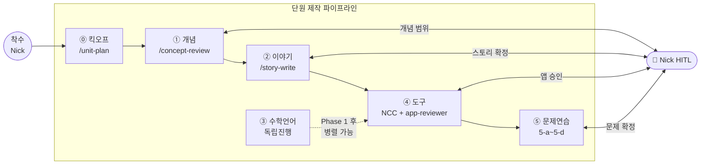

### 산출물 위치

| Phase | 산출물 경로 |
|---|---|
| 0 | `chatlog/YYMMDD_unitNN.md` + `50_units/NN/` 폴더 구조 |
| 1 | `40_BaseDocs/NN_단원명/*.md` |
| 2 | `50_units/NN/story/unitNN.md` |
| 3 | `40_BaseDocs/00_literacy/LN_주제/LN_app.html` |
| 4 | `50_units/NN/app/` (index / story / 개념탐구 / concepts) |
| 5-a | `50_units/NN/app/problems.html` |
| 5-b | `50_units/NN/problems/types.md` |
| 5-c | `50_units/NN/problems/type_NN_app.html` |
| 5-d | `50_units/NN/problems/QN.md + QN_app.html + QN_practice_app.html` |

---

## 2. Phase 0 — 킥오프

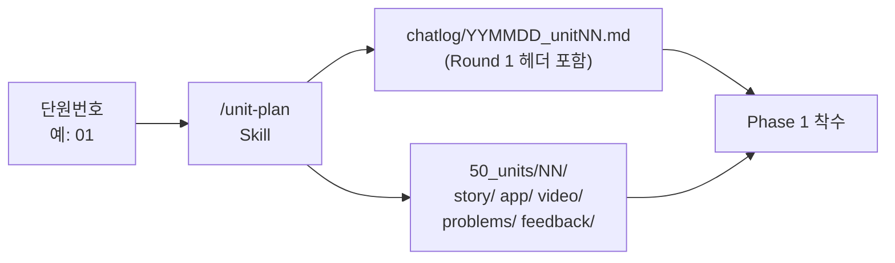

| 항목 | 내용 |
|---|---|
| **입력** | 단원번호 |
| **AI 도구** | `/unit-plan` Skill |
| **산출물** | chatlog 파일 + 디렉토리 구조 |
| **HITL** | 없음 (자동 실행) |

**검토 메모**: chatlog에 Round 1 섹션 헤더 + 검수 대상 파일 목록이 자동 생성되면 다음 작업 속도 향상. 현재는 수동.

---

## 3. Phase 1 — 개념 (축 A)

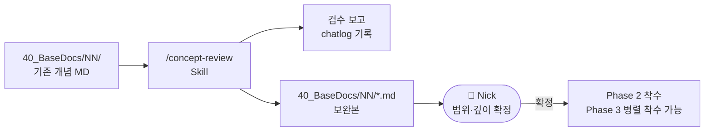

| 항목 | 내용 |
|---|---|
| **입력** | `40_BaseDocs/NN_단원명/` MD 파일 5~7개 |
| **AI 도구** | `/concept-review` Skill |
| **NCC 작업** | 정확성·중1 수준·범위 검수 → 보완 제안 |
| **산출물** | 검수 보고 (chatlog) + 보완된 개념 MD |
| **HITL** | 개념 범위·깊이 확정 |

**검토 메모**: 신규 단원처럼 `40_BaseDocs` 없을 때 "신규 작성" 모드 미지원. Phase 1 완료 후 Phase 3을 Phase 2와 병렬로 착수 가능 — 이전 버전에 명시 안 됨.

---

## 4. Phase 2 — 이야기 (축 B)

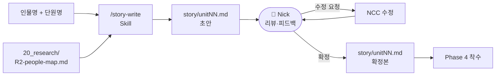

| 항목 | 내용 |
|---|---|
| **입력** | 인물명, 단원명, 리서치 자료 |
| **AI 도구** | `/story-write` Skill |
| **NCC 작업** | 인물 리서치 + 스토리 초안 |
| **산출물** | `story/unitNN.md` 확정본 |
| **HITL** | 스토리 확정 — 반복 가능 (초안 → 피드백 → 수정 × N회) |

**검토 메모**: 이전 버전에 리뷰 반복 루프가 명시 안 됨. Phase 4는 반드시 스토리 확정 후 착수.

---

## 5. Phase 3 — 수학 언어 (축 C)

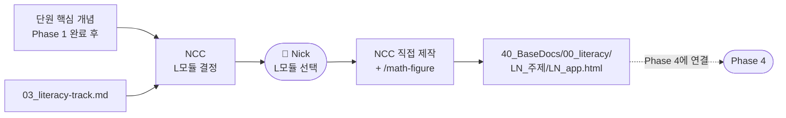

| 항목 | 내용 |
|---|---|
| **입력** | 단원 핵심 개념, literacy-track.md |
| **AI 도구** | NCC 직접 제작 + `/math-figure` |
| **NCC 작업** | L모듈 결정 + 인터랙티브 HTML 제작 |
| **산출물** | `40_BaseDocs/00_literacy/LN_*/LN_app.html` |
| **HITL** | L모듈 선택 협의 |
| **비고** | 단원 횡단 자료 → `50_units/` 아닌 `40_BaseDocs/`에 저장 |

**검토 메모**: Phase 2와 병렬 진행 가능 (Phase 1 완료 후 즉시 착수 가능). L모듈 없는 단원은 Phase 3 생략 가능 — 명시 필요. 전용 Skill 없음 → 반복 시 `/literacy-make` 신설 검토.

---

## 6. Phase 4 — 인터랙티브 앱 (축 A+B 통합)

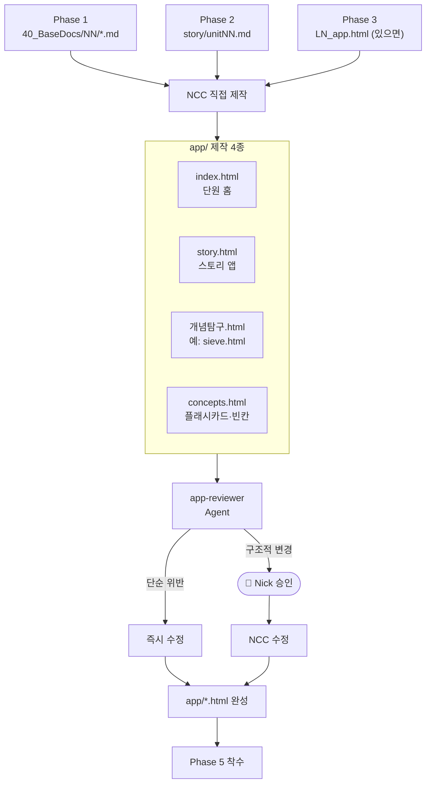

| 항목 | 내용 |
|---|---|
| **입력** | Phase 1, 2, 3 산출물 |
| **AI 도구** | NCC 직접 제작 → `app-reviewer` Agent |
| **제작 앱** | index / story / 개념탐구 / concepts (4종, problems.html 제외) |
| **app-reviewer** | APP_PRINCIPLES.md 기준 검토. 단순 위반 즉시 수정, 구조적 변경 → HITL |
| **산출물** | `50_units/NN/app/*.html` |
| **HITL** | 구조적 앱 변경 승인, 수학 정확성 확인 |

**검토 메모**: `problems.html`은 Phase 4에서 분리 → Phase 5-a로 이동. 이유: 문제 내용(QN_source.md)이 먼저 확정돼야 앱 생성 가능.

---

## 7. Phase 5 — 문제 연습 (축 D)

### Phase 5 전체 구조

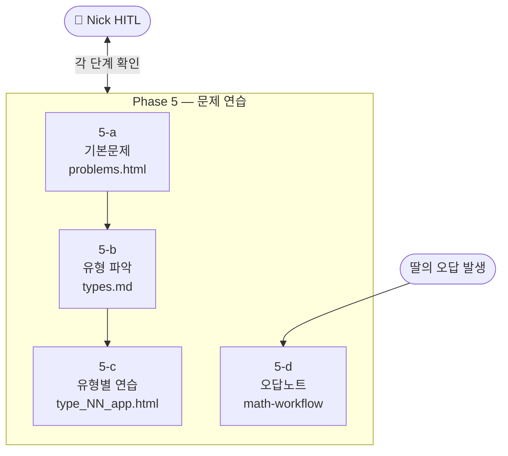

---

### Phase 5-a — 기본문제

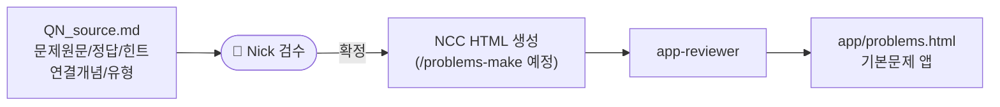

| 항목 | 내용 |
|---|---|
| **입력** | `QN_source.md` (문제 원문 / 정답 / 힌트 / 연결 개념) |
| **AI 도구** | NCC 직접 제작 → `app-reviewer` |
| **목적** | 단원 전체 개념을 고루 확인하는 충실한 기본문제 |
| **산출물** | `50_units/NN/app/problems.html` |
| **HITL** | QN_source.md 확정 (개념 커버리지 판단) |
| **현재 Skill** | 없음 → `/problems-make` 신설 필요 (🔴 높음) |

---

### Phase 5-b — 유형 파악

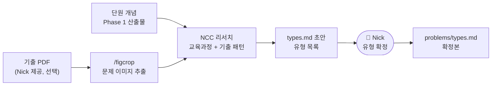

| 항목 | 내용 |
|---|---|
| **입력** | 단원 개념 + 교육과정 기출 패턴 + (선택) 기출 PDF |
| **AI 도구** | NCC 리서치 (WebSearch / `/figcrop`) |
| **목적** | 시험에 나올 법한 유형 목록 확정 |
| **산출물** | `problems/types.md` |
| **HITL** | 유형 목록 확정 (시험 맥락은 Nick만 파악) |
| **현재 Skill** | 없음 → `/problem-types` 신설 검토 (🟡 중간) |

**Unit 1 유형 예시 (초안):**

| 유형 | 내용 |
|---|---|
| T1 | 소인수분해 직접 계산 |
| T2 | 소인수분해 이용한 GCD |
| T3 | 소인수분해 이용한 LCM |
| T4 | 약수 개수 구하기 |
| T5 | GCD·LCM 활용 (실생활) |

> Nick 확정 필요.

---

### Phase 5-c — 유형별 연습

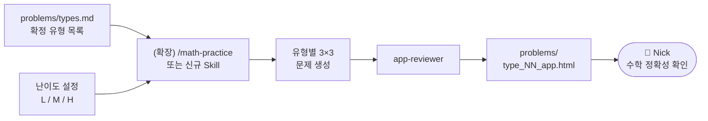

| 항목 | 내용 |
|---|---|
| **입력** | `types.md` + 난이도 설정 |
| **AI 도구** | `/math-practice` 확장 또는 신규 Skill |
| **목적** | 유형별 × L/M/H 3×3 = 9문제 연습 앱 |
| **산출물** | `problems/type_NN_app.html` |
| **HITL** | 수학 정확성 확인 |
| **3/3/3 원칙** | 이 단계에 적용 — 유형 × (L×3 + M×3 + H×3) |

> **3/3/3 위치 재정의**: 기존에는 오답노트(5-d) 뒤에 붙었으나, **5-c 유형별 연습이 3/3/3의 원래 의도**에 맞음. 5-d `/math-practice`는 오답 문제 1개에 집중하는 용도로 재한정.

---

### Phase 5-d — 오답노트

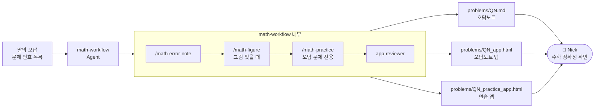

| 항목 | 내용 |
|---|---|
| **입력** | 딸이 실제로 틀린 문제 번호 목록 |
| **AI 도구** | `math-workflow` Agent |
| **내부 Skill** | `/math-error-note` → `/math-figure` → `/math-practice` → `app-reviewer` |
| **산출물** | `QN.md` + `QN_app.html` + `QN_practice_app.html` |
| **HITL** | 수학 정확성 최종 확인 |
| **비고** | 기존 구조 유지. 딸이 실제 공부 시작 후 발동. |

---

## 8. 문제 출제·검증 흐름 (상세)

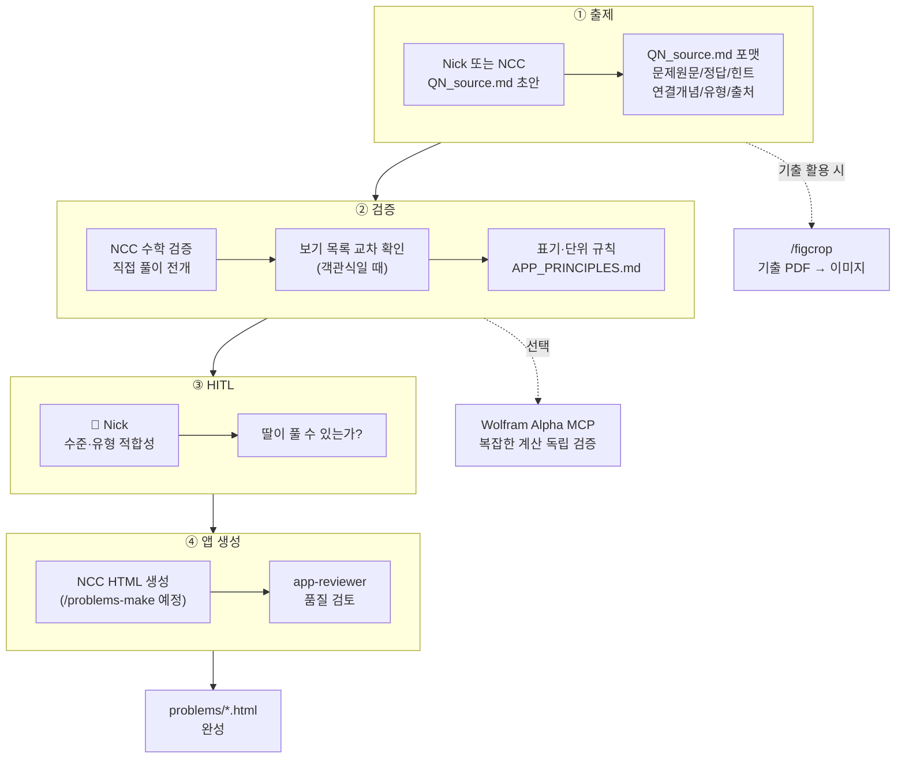

---

## 9. Agent / Skill 카탈로그

### 현재 등록 도구

| 도구 | 유형 | Phase | 입력 | 산출물 | 상태 |
|---|---|---|---|---|---|
| `/unit-plan` | Skill | 0 | 단원번호 | chatlog + 디렉토리 | ✅ |
| `/concept-review` | Skill | 1 | 단원번호 | 개념 MD 검수 보고 | ✅ |
| `/story-write` | Skill | 2 | 인물명, 단원명 | `story/unitNN.md` | ✅ |
| `/math-figure` | Skill | 3, 5 | 개념/문제번호 | SVG/JSXGraph | ✅ |
| `/math-error-note` | Skill | 5-d | 문제번호, 단원 | `QN.md` + `QN_app.html` | ✅ |
| `/math-practice` | Skill | 5-d | 문제번호 | `QN_practice_app.html` | ✅ (5-d 전용 재한정) |
| `/video-make` | Skill | 4 | 스크립트 | `video/*.mp4` | ✅ |
| `/figcrop` | Skill | 5-b | 시험지 이미지 | 크롭된 그림 | ✅ |
| `app-reviewer` | Agent | 4, 5 | HTML 앱 경로 | 위반 보고 + 수정 | ✅ |
| `math-workflow` | Agent | 5-d | 오답 번호 목록 | 오답노트 전체 산출물 | ✅ (5-d 전용으로 범위 한정) |

### 신설 필요 도구

| 도구 | 유형 | Phase | 역할 | 우선순위 |
|---|---|---|---|---|
| `/problems-make` | Skill | 5-a | QN_source.md → problems.html 자동 생성 | 🔴 높음 (Unit 2부터 필요) |
| `/problem-types` | Skill | 5-b | 단원 개념 + 기출 → types.md 초안 생성 | 🟡 중간 |

### Skill vs Agent 구분

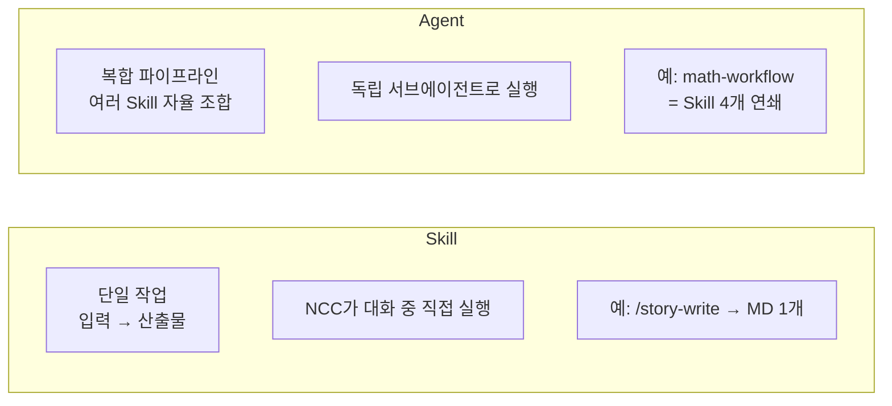

---

## 10. 외부 도구 연동

| 도구 | 용도 | 연동 방법 | 상태 |
|---|---|---|---|
| **Wolfram Alpha MCP** | 수식·정답 독립 검증 (NCC 검증 이중화) | `.claude/settings.json` MCP 설정 | 🔲 미결정 |
| **교육청 기출 PDF** | 유형 목록 근거, 실제 시험 문제 확인 | Nick 제공 → `/figcrop` → NCC 분석 | 🔲 Nick 제공 필요 |
| **Khan Academy** | 유형·난이도 패턴 참고 | NCC WebSearch 즉시 사용 가능 | ✅ |
| **Desmos embed** | 그래프 대안 (JSXGraph 비교) | `<iframe>` embed, 별도 연동 불필요 | 🔲 필요 시 |

> **현재 검증 방식**: NCC 직접 풀이. Unit 1에서 버그 3건 발견·수정. 복잡한 계산 포함 문제가 많아질 경우 Wolfram Alpha MCP 도입 효과 있음.

---

## 11. HITL 포인트 전체 요약

| Phase | HITL 포인트 | 이유 |
|---|---|---|
| 1 | 개념 범위·깊이 확정 | 중1 수준 판단은 Nick만 가능 |
| 2 | 스토리 확정 (반복 가능) | 딸에게 맞는 감성·사실 검증 |
| 4 | 구조적 앱 변경 승인 | UX 방향은 Nick 판단 |
| 5-a | QN_source.md 확정 | 개념 커버리지 적합성 |
| 5-b | 유형 목록 확정 | 시험 맥락은 Nick만 파악 |
| 5-c | 수학 정확성 확인 | 오류가 딸에게 전달되면 안 됨 |
| 5-d | 수학 정확성 확인 | 오류가 딸에게 전달되면 안 됨 |

---

## 12. Batch 처리 계획

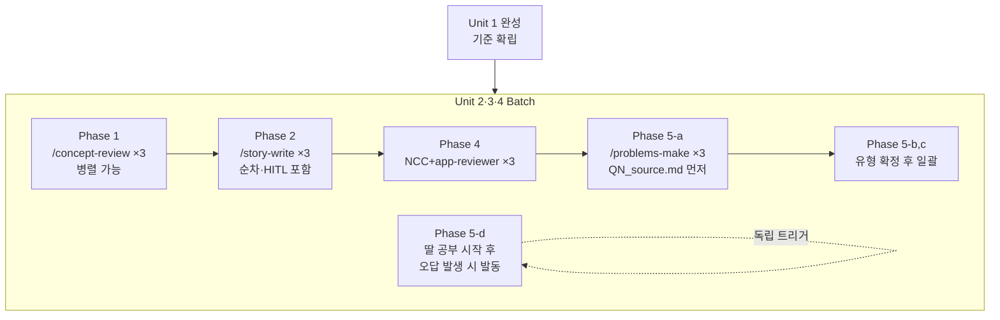

---

*참조: CLAUDE.md / APP_PRINCIPLES.md / .claude/skills/ / .claude/agents/*
