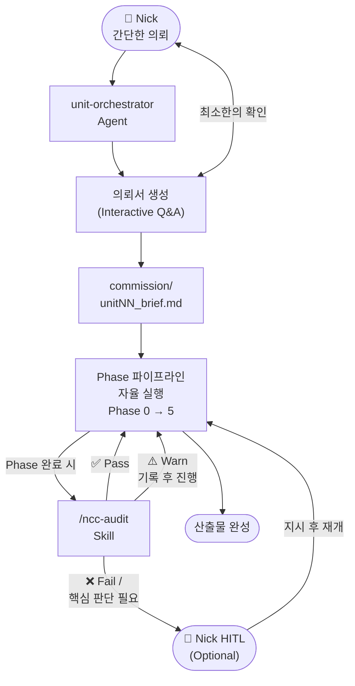
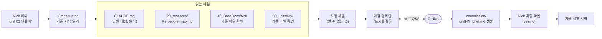
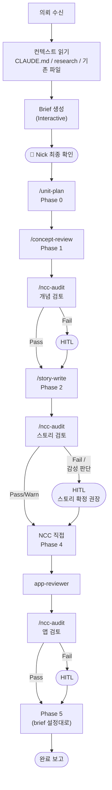
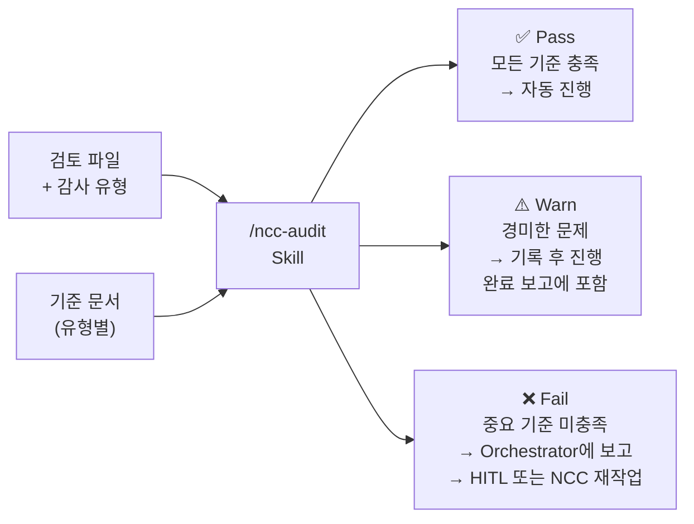
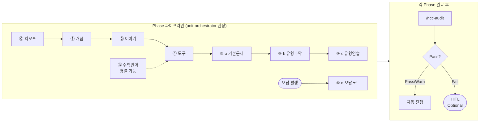

<!-- 10_docs/13_workflow_v3.md -->
# MathTelling — Workflow v3

> 날짜: 2026-05-09
> v2(12_workflow_update.md) 대비 주요 변경: Orchestrator 추가, HITL optional, NCC Audit Skill 신설, 의뢰 프로세스 정의.

---

## v2 대비 변경 요약

| 항목 | v2 | v3 |
|---|---|---|
| 파이프라인 관장 | 없음 (NCC가 직접 실행) | **unit-orchestrator Agent** 명시 |
| HITL | 각 Phase 필수 | **Optional** — NCC Audit으로 대체 가능 |
| NCC 자체 검토 | 없음 | **/ncc-audit Skill** 신설 |
| 의뢰 방식 | Nick이 상세 지시 | Nick 간단 의뢰 → Orchestrator가 brief 생성 → 자율 진행 |

---

## 0. 전체 아키텍처



**핵심 원칙:**
- Nick은 최소 입력 → Orchestrator가 나머지를 채운다
- NCC Audit이 Pass/Warn이면 자율 진행
- HITL은 NCC가 판단할 수 없는 경우에만 발동

---

## 1. 의뢰 프로세스 (Commission Process)

### 1-1. Nick의 의뢰 방법

Nick이 할 일은 딱 하나: **간단한 의뢰 한 줄**

```
예시:
  "unit 02 만들어"
  "01번 단원 phase 4까지 작업해줘"
  "unit 3 이야기 먼저"
```

### 1-2. 의뢰서 생성 흐름



### 1-3. Commission Brief 포맷

```
commission/unit02_brief.md 예시
─────────────────────────────────
단원번호: 02
단원명: 정수·유리수
인물: 브라마굽타
L모듈: L3_수식읽기 (NCC 추천)

Phase 실행 범위:
  Phase 1: ✅ 실행  (40_BaseDocs/02/ 파일 있음)
  Phase 2: ✅ 실행
  Phase 3: ✅ 실행  (L3 연결)
  Phase 4: ✅ 실행
  Phase 5-a: ✅ 실행
  Phase 5-b,c: ⏸ 보류  (Nick 유형 확정 후)
  Phase 5-d: ⏸ 보류  (딸 공부 시작 후)

HITL 설정:
  스토리 확정 (Phase 2): 수동  ← 항상 Nick 확인
  수학 정확성: NCC Audit 자동
  나머지: NCC Audit Pass 시 자동 진행

특이사항: [Nick이 추가한 내용]
─────────────────────────────────
```

### 1-4. Q&A 예시 (Orchestrator가 Nick에 묻는 것)

Orchestrator는 자동으로 알 수 없는 것만 묻는다:

```
[자동 채움 완료]
  단원명: 정수·유리수 ✅ (CLAUDE.md)
  인물: 브라마굽타 ✅ (CLAUDE.md)
  기존 40_BaseDocs/02/: 파일 5개 있음 ✅

[확인 필요]
  Q1. Phase 5 (문제 연습)도 포함할까요? [yes/no]
  Q2. L모듈 L3_수식읽기 연결 동의하시나요? [yes/no]
  Q3. 추가 지시사항 있으신가요? [없으면 Enter]
```

Nick은 "yes yes 없음" 정도로 답변 가능.

---

## 2. unit-orchestrator Agent

### 역할

| 항목 | 내용 |
|---|---|
| **유형** | Agent |
| **트리거** | Nick의 단원 제작 의뢰 |
| **역할** | 전체 파이프라인 관장, brief 생성, Phase 자율 실행, audit 조율, HITL 판단 |
| **사용 Skills** | 모든 기존 Skill + `/ncc-audit` |
| **사용 Agents** | `app-reviewer`, `math-workflow` |
| **지식 베이스** | CLAUDE.md, commission brief, learner-profile.md |

### 실행 로직



### Orchestrator가 보유하는 체크리스트

```
unit-orchestrator 내부 checklist:
  ✅ 40_BaseDocs/NN/ 존재 확인
  ✅ 인물 배정 (CLAUDE.md 참조)
  ✅ L모듈 연결 가능성 (literacy-track.md 참조)
  ✅ 기존 50_units/NN/ 파일 충돌 확인
  ✅ Phase 5 포함 여부 (brief 설정)
  ✅ 각 Phase 완료 후 audit 실행
  ✅ HITL 필요 여부 판단 기준 보유
```

---

## 3. /ncc-audit Skill (신설)

### 역할

NCC가 산출물을 **기준 문서와 대조해 자체 검토**하는 Skill.  
Orchestrator가 Phase 완료 시 자동 호출. Nick이 직접 호출도 가능.

### 입출력

| 항목 | 내용 |
|---|---|
| **입력** | 검토 파일 경로 + 감사 유형 (concept / story / app / math / problem) |
| **기준 문서** | 유형별로 다름 (아래 표) |
| **출력** | 감사 보고 (Pass/Warn/Fail 각 기준별) + 권장 조치 |

### 감사 유형별 기준 문서

| 감사 유형 | 기준 문서 | 주요 검토 항목 |
|---|---|---|
| `concept` | `learner-profile.md`, 교육과정 | 중1 수준 적합성, 정의 정확성 |
| `story` | `learner-profile.md`, `02_R2-people-map.md` | 사실 정확성, 감성 적합성, 분량 |
| `app` | `APP_PRINCIPLES.md` | 원칙 준수 여부 (빈칸, 말투, 구조) |
| `math` | 단원 개념 MD, 직접 계산 | 정답 정확성, 보기 일치, 표기 |
| `problem` | 단원 개념 MD, `learner-profile.md` | 난이도 적합성, 개념 커버리지 |

### 판정 기준



### Pass / Warn / Fail 정의

| 판정 | 조건 | 후속 행동 |
|---|---|---|
| **Pass** | 모든 기준 항목 충족 | 자동 다음 Phase |
| **Warn** | 경미한 불일치 (표기 규칙 등) | 기록 후 자동 진행. 완료 보고에 포함 |
| **Fail** | 수학 오류, 심각한 원칙 위반, NCC가 판단 불가한 항목 | Orchestrator → HITL 발동 |

---

## 4. HITL — Optional 정책

### 필수 HITL (항상 Nick 확인)

| Phase | 이유 |
|---|---|
| Phase 2 스토리 확정 | 딸에 대한 감성 판단은 Nick만 가능 |
| Phase 5-b 유형 목록 | 시험 맥락은 Nick만 파악 |

> 이 두 항목만 항상 Nick 확인. 나머지는 NCC Audit 결과에 따라 자동/수동 결정.

### Optional HITL (NCC Audit Fail 시에만 발동)

| Phase | NCC Audit Pass 시 | NCC Audit Fail 시 |
|---|---|---|
| Phase 1 개념 검수 | 자동 진행 | Nick 확인 |
| Phase 4 앱 변경 | 단순 위반 즉시 수정 | 구조적 변경 → Nick |
| Phase 5-a 기본문제 | NCC 수학 검증 Pass → 자동 | 오류 발견 → Nick |
| Phase 5-c 유형 연습 | NCC 수학 검증 Pass → 자동 | 오류 발견 → Nick |
| Phase 5-d 오답노트 | NCC 수학 검증 Pass → 자동 | 오류 발견 → Nick |

### Nick이 개입하는 법

Nick은 언제든지 개입 가능:
- chatlog에서 "잠깐, Phase 1 결과 보여줘" → Orchestrator가 보고 제공
- "스토리 마음에 안 들어, 다시" → Orchestrator가 재실행
- "여기서 멈춰" → Orchestrator가 현재 Phase에서 대기

---

## 5. Phase 파이프라인 요약

(상세 I/O는 `12_workflow_update.md` 참조)



---

## 6. 업데이트된 Agent / Skill 카탈로그

### 전체 도구 (신설 포함)

| 도구 | 유형 | Phase | 역할 | 상태 |
|---|---|---|---|---|
| `unit-orchestrator` | Agent | 전체 | 파이프라인 관장, brief 생성, 자율 실행 | 🔴 신설 필요 |
| `/ncc-audit` | Skill | 전 Phase | NCC 자체 감사 (Pass/Warn/Fail) | 🔴 신설 필요 |
| `/unit-plan` | Skill | 0 | chatlog + 디렉토리 생성 | ✅ |
| `/concept-review` | Skill | 1 | 개념 MD 검수 | ✅ |
| `/story-write` | Skill | 2 | 스토리 초안 생성 | ✅ |
| `/math-figure` | Skill | 3, 5 | 그래프 생성 | ✅ |
| `/math-error-note` | Skill | 5-d | 오답노트 MD + 앱 | ✅ |
| `/math-practice` | Skill | 5-d | 오답 연습 앱 | ✅ |
| `/video-make` | Skill | 4 | 영상 제작 | ✅ |
| `/figcrop` | Skill | 5-b | 시험지 이미지 크롭 | ✅ |
| `/problems-make` | Skill | 5-a | QN_source.md → HTML | 🟡 신설 검토 |
| `/problem-types` | Skill | 5-b | 유형 목록 초안 생성 | 🟡 신설 검토 |
| `app-reviewer` | Agent | 4, 5 | 앱 품질 검토·수정 | ✅ |
| `math-workflow` | Agent | 5-d | 오답노트 파이프라인 | ✅ |

### 신설 우선순위

| 우선순위 | 도구 | 이유 |
|---|---|---|
| 🔴 즉시 | `unit-orchestrator` | 자율 진행의 핵심 |
| 🔴 즉시 | `/ncc-audit` | optional HITL의 전제 |
| 🟡 Unit 2 전 | `/problems-make` | 기본문제 생성 자동화 |
| 🟢 이후 | `/problem-types` | 유형 파악 자동화 |

---

## 7. 예시 실행 시나리오 — Unit 02 전체 제작

```
Nick: "unit 02 만들어"

Orchestrator:
  1. CLAUDE.md 읽기 → 단원명: 정수·유리수, 인물: 브라마굽타 파악
  2. 40_BaseDocs/02/ 확인 → 개념 MD 5개 있음
  3. 50_units/02/ 확인 → 비어있음 (신규 제작)

  확인 Q&A (3가지만):
    Q1. Phase 5 (문제 연습) 포함할까요? → Nick: yes
    Q2. L4_방정식표기 L모듈 연결 제안. 동의? → Nick: yes
    Q3. 추가 지시사항? → Nick: (없음)

  → commission/unit02_brief.md 생성
  Nick: "맞아. 시작해."

  Phase 0: /unit-plan → 디렉토리 생성
  Phase 1: /concept-review → 개념 검수
    /ncc-audit(concept) → ✅ Pass → 자동 진행
  Phase 2: /story-write → 스토리 초안
    /ncc-audit(story) → ⚠️ Warn (사실 확인 1건 메모)
    → 자동 진행 (HITL 권장 but Pass 기준 충족)
    → ❗ 스토리 확정은 필수 HITL → Nick 확인 요청
  Nick: "좋아" → Phase 4 진행
  Phase 4: 앱 4종 제작 → app-reviewer → /ncc-audit(app) → Pass → 완성
  Phase 5-a: QN_source.md → problems.html → /ncc-audit(math) → Pass
  Phase 5-b: types.md 초안 → ❗ 유형 확정 필수 HITL → Nick 확인 요청
  Nick: "T1~T5 맞아" → Phase 5-c 진행
  Phase 5-c: 유형별 연습 앱 → /ncc-audit(math) → Pass → 완성

  완료 보고: "Unit 02 제작 완료. Warn 1건 메모 첨부."
```

---

## 8. 신설 Agent/Skill 정의서 초안

### unit-orchestrator Agent

```
이름: unit-orchestrator
파일: .claude/agents/unit-orchestrator.md
역할: MathTelling 단원 제작 전체 파이프라인 관장
트리거: "unit NN 만들어" 또는 "unit NN phase N 작업"

수행 절차:
  1. 의뢰 파악 → 컨텍스트 읽기 (CLAUDE.md, research, 기존 파일)
  2. Brief 생성 → 미결 항목만 Nick에 질문 (최소 3가지 이내)
  3. commission/unitNN_brief.md 저장 → Nick 최종 확인
  4. Phase 순서대로 자율 실행 (brief 설정 기반)
  5. 각 Phase 완료 후 /ncc-audit 호출
  6. Fail 또는 필수 HITL → Nick 보고 대기
  7. 완료 보고 (Warn 목록 포함)
```

### /ncc-audit Skill

```
이름: ncc-audit
파일: .claude/skills/ncc-audit.md
역할: 산출물을 기준 문서와 대조해 Pass/Warn/Fail 판정

입력:
  - 검토 파일 경로 (1개 이상)
  - 감사 유형: concept | story | app | math | problem

절차:
  1. 감사 유형에 맞는 기준 문서 읽기
  2. 산출물 읽기
  3. 기준 항목별 체크
  4. 판정: Pass (모두 OK) / Warn (경미) / Fail (중요 오류)
  5. 보고서 출력: 판정 + 항목별 이유 + 권장 조치

출력: 감사 보고서 (chatlog 기록 또는 인라인)
```

---

*참조: CLAUDE.md / APP_PRINCIPLES.md / 12_workflow_update.md (Phase 상세 I/O)*
